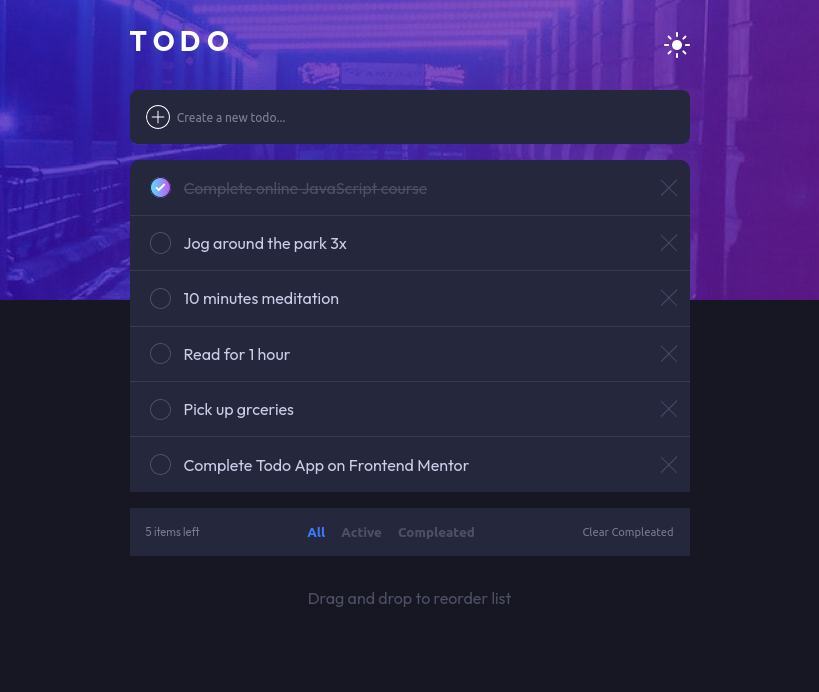
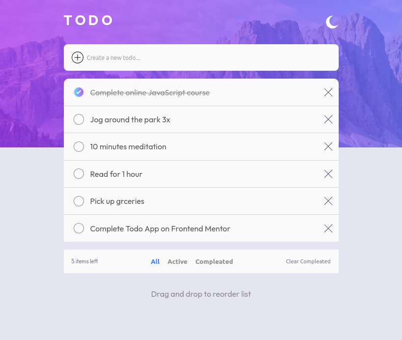
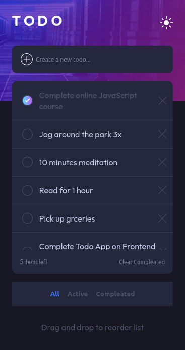
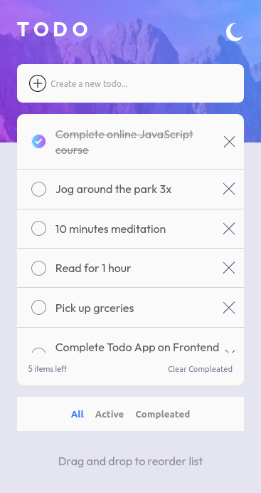

# Frontend Mentor - Todo app solution

This is a solution to the [Todo app challenge on Frontend Mentor](https://www.frontendmentor.io/challenges/todo-app-Su1_KokOW). Frontend Mentor challenges help you improve your coding skills by building realistic projects.

## Table of contents

- [Overview](#overview)
  - [The challenge](#the-challenge)
  - [Screenshot](#screenshot)
  - [Links](#links)
- [My process](#my-process)
  - [Built with](#built-with)
  - [What I learned](#what-i-learned)
  - [Continued development](#continued-development)
  - [Useful resources](#useful-resources)
- [Author](#author)

## Overview

### The challenge

Users should be able to:

- View the optimal layout for the app depending on their device's screen size
- See hover states for all interactive elements on the page
- Add new todos to the list
- Mark todos as complete
- Delete todos from the list
- Filter by all/active/complete todos
- Clear all completed todos
- Toggle light and dark mode
- Drag and drop to reorder items on the list
- Drag and drop to reorder items on a mobile device

### Screenshot

### Links

#### React JS Version

- Solution URL: [GitHub](https://github.com/hectorgarcia07/FEM-React-Todo)
- Live Site URL: [Netlify](https://hector-fm-todo-app.netlify.app/)

#### Vanilla JS Version

- Solution URL: [GitHub](https://github.com/hectorgarcia07/FEM-To-Do)
- Live Site URL: [GitHub Pages](https://hectorgarcia07.github.io/FEM-To-Do/)

## My process

### Built with

- React JS
- Framer-Motion
- Semantic HTML5 markup
- CSS custom properties
- Flexbox
- Mobile-first workflow

### What I learned

Decided to refeactor my previous solution that used vainlla JS and CSS and incorporated the
React framework. I also used Framer Motion to handle transitions and reordering of the todo list
to work well on desktop and mobile devices.

### Continued development

For future development, I would like to transform this into a full stack application. I will also use Express.js to handle routing and MongoDB to save users and their ‘todo’ data.

### Useful resources

- [Theme switcher](https://medium.com/swlh/dark-mode-using-css-variables-cf065a7fa133) - A pretty good resource that shows how to create a theme switcher.
- [How to use gradients as a border](https://codyhouse.co/nuggets/css-gradient-borders) - A challenge that I had was using gradients as a border color. This blog helped me acheive that goal.
- [Drag and drop functionality](https://webdevtrick.com/html-drag-and-drop-list/) - A great source that shows how to create a drag and drop feature using HTML5 Drag and drop API
- [Custom Checkbox](https://www.leenix.co.uk/news-css-tricks-using-images-as-checkboxes-in-your-html-forms-19) - This was useful in creating a custom checkbox that acts and responds to a users check toggle
- [Custom Checkbox that are accessible](https://codyhouse.co/blog/post/custom-accessible-radio-checkbox-buttons-vertical-alignment) - Another good source but goes into depty in how to make your custom checkbox accessible for those who rely on keyboard navigation.
- [Framer Motion library](https://www.framer.com/motion/) - Library used to make beautiful animations/transitions.

## Author

- GitHub - [Hector's GitHub](https://github.com/hectorgarcia07)
- Frontend Mentor - [@hectorgarcia07](https://www.frontendmentor.io/profile/hectorgarcia07)
- Twitter - [@jdbjfl](https://www.twitter.com/jdbjfl)
